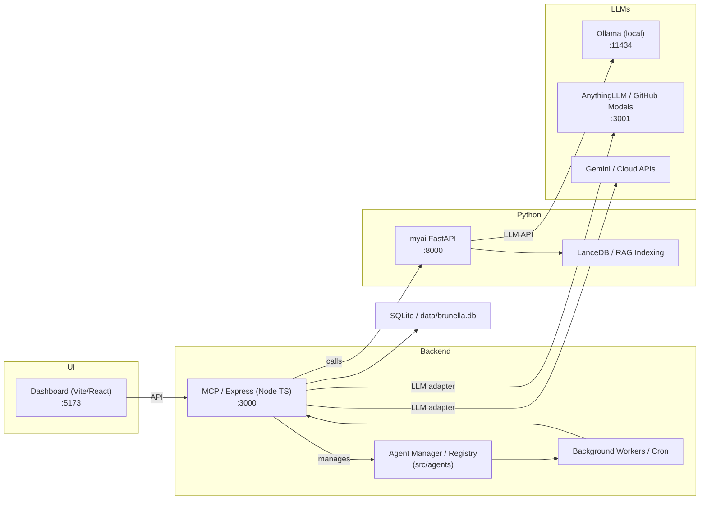
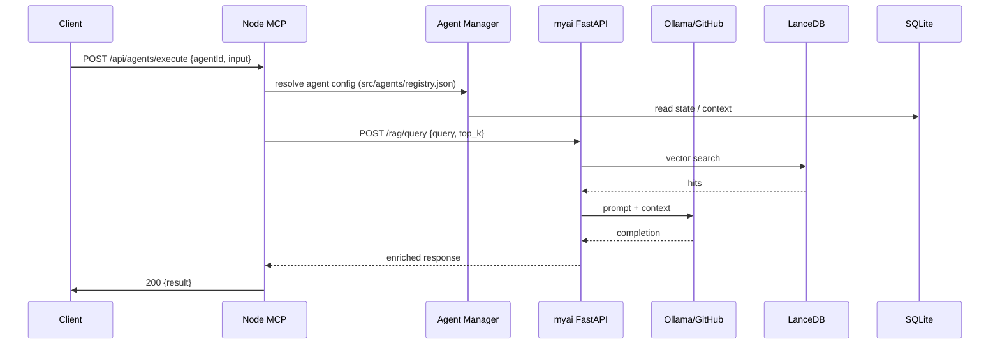

# BRUNELLA AGENT SYSTEM — SYSTEM DOCUMENTATION / RENDSZERLEÍRÁS

> Executive Summary (English)
>
> Brunella Agent System (BAS) is a hybrid multi-agent orchestration platform combining a Node.js TypeScript MCP server, a Python FastAPI intelligence subsystem, multiple local and cloud LLM adapters (Ollama, AnythingLLM / GitHub Models, Gemini), and a RAG/vector indexing layer (LanceDB). It provides developer tooling (CLI, dashboard), agent/skill registry, orchestration and background workers for production automation. This document is the single-source-of-truth system blueprint: architecture, runbook, component specs, data model, workflows, integrations, security, observability, scalability guidance, decision matrix and a 100% coverage verification checklist.

---

# 1. Executive Summary / Vezetői összefoglaló (Magyar)

A Brunella Agent System (BAS) egy többnyelvű, moduláris, helyi és felhő LLM-eket kombináló multi-ügynök platform. Node.js (TypeScript) az orchestration és MCP szerver logika platformja, Python (FastAPI) futtatja az AI-specifikus komponenseket (RAG, browser automation, training). A rendszer célja: gyors kísérleti fejlesztés, megbízható lokális AI futtatás (Ollama) és felhő integráció (Gemini, GitHub Models). Ez a dokumentum solution-architect stílusban ad konkrét technikai döntéseket, adatmodelleket, pseudokódot, futtatási és üzemeltetési utasításokat, valamint verifikációs lépéseket.

---

# 2. Requirements recap / Célok és követelmények

- Purpose: Orchestrálni és futtatni AI ügynököket (agents & skills), biztosítani RAG/knowledge retrieval-t, üzemeltetni fejlesztői és production környezetet.
- Constraints: támogatás Windows + *nix fejlesztéshez; helyi LLM integráció (Ollama) és cloud API-k; offline-first képességek; technikai csapat TypeScript/Python kompetenciával.
- Non-functional requirements:
  - Reliability: szolgáltatások automatikus health-check és restart konfigurációval
  - Observability: tracing & metrics (OpenTelemetry + Prometheus)
  - Testability: unit/e2e integrált tesztek (vitest, playwright, pytest)
  - Scalability: horizontális skálázás a stateless komponensek számára
  - Security: titkok kezelés Vault/GitHub Secrets, TLS for external APIs

---

# 3. Architecture diagrams

## 3.1 High-level system shape (Mermaid + ASCII fallback)



ASCII fallback:

UI -> MCP
MCP -> MyAI
MCP -> AgentManager
MCP -> DB
MyAI -> RAG
MyAI -> Ollama
MCP -> AnythingLLM
MCP -> Gemini
Workers -> MCP

---

## 3.2 Typical request data-flow: agent invocation → LLM → components



ASCII fallback:
Client -> MCP -> Agent -> DB
MCP -> Python -> RAG -> LLM -> Python -> MCP -> Client

---

# 4. Solution-Architect Design

This section follows the Phase 1-5 methodology. (Magyar rész következik.)

## 4.1 Phase 1 — Requirements Analysis (Magyar)

- Implicit needs:
  - Low-latency local LLM calls for interactive agents → Ollama on localhost
  - Scalable orchestration for many agents concurrently → MCP is stateless per request, allows horizontal scaling
  - Persistent knowledge / RAG for retrieval → LanceDB recommended with backup/migration
- Missing clarifications (open questions):
  1. Expected peak concurrent agent requests (requests/sec)
  2. Expected embedding corpus size (GB / millions embeddings)
  3. SLA targets (P95 latency goal for agent response)

(Please answer above to tune scaling recommendations.)

## 4.2 Phase 2 — Architecture Design (Magyar)

- Chosen system shape: hybrid (orchestrator + specialized AI microservices). Rationale: TypeScript ecosystem for orchestration and developer tooling, Python for ML/LLM-heavy tasks (langchain, lance), easier to reuse existing libraries.
- Component responsibilities (summary):
  - MCP/Express: REST + MCP tools, agent lifecycle
  - Agent Manager: registry.json driven configuration, access control
  - Python myai: RAG, embedding, browser automation
  - LLM Adapters: abstract model access, fallback strategy
  - DB: SQLite for metadata; LanceDB for vectors
  - Dashboard: developer UX
- Failure modes & mitigations:
  - LLM unavailability → circuit breaker + local cache + degrade gracefully
  - RAG failures → fallback to empty context or cached results
  - DB corruption → fallback to replica/backup, migrate SQLite to managed DB for production

## 4.3 Phase 3 — Data Structures & Schema (Magyar)

- Entities:
  - Agent { id, name, model, permissions, config }
  - Skill { id, version, entry, tests }
  - Session { session_id, agent_id, messages[], last_updated }
  - Embedding { id (source_hash), vector, metadata }
- Storage recommendations:
  - Use LanceDB collections for embeddings; namespace by project
  - Use SQLite for low-volume metadata; for high concurrency migrate to Postgres
- Indexing:
  - Index embeddings by source_id and inserted_at
  - Keep per-source checkpoints (content_hash)

## 4.4 Phase 4 — Logic & Algorithms (Pseudocode, Magyar)

### Agent request lifecycle (detailed pseudocode)

```
function executeAgent(request) {
  request_id = request.request_id || uuid()
  try {
    agent = AgentManager.load(request.agentId)
    session = DB.getSession(agent.sessionKey)
    if (agent.useRAG) {
      ragResponse = HTTP.post("http://localhost:8000/rag/query", {query: request.input, top_k: agent.ragTopK})
      context = ragResponse.hits
    }
    prompt = PromptBuilder.build(request.input, context)
    llmResp = LLMAdapter.call(agent.preferredModel, prompt, {request_id})
    if (llmResp.error && llmResp.retriable && retries < 3) retryWithBackoff()
    DB.appendConversation(session.id, request.input, llmResp)
    return llmResp
  } catch (ex) {
    Logger.error(ex)
    return {error: 'internal_error', code: 500}
  }
}
```

Idempotency: use request_id + detect duplicate requests in DB before executing side-effects.

### RAG indexing job (pseudocode)

```
for source in sources:
  text = extract(source)
  id = sha256(text)
  if not LanceDB.exists(id):
    embedding = embedModel.embed(text)
    LanceDB.insert(id, embedding, {source})
  else if source.changed:
    LanceDB.update(id, newEmbedding)
```

Error handling: partial failures logged and retried; job marks status per-source.

## 4.5 Phase 5 — Validation & Trade-offs (Magyar)

- Trade-offs:
  - SQLite simplicity vs concurrency: SQLite chosen for local dev; for production prefer Postgres or D1 (Cloudflare) for multi-writer
  - Ollama local low latency vs cloud models broader capability: default to Ollama for interactive flows, cloud for heavy-duty tasks
  - LanceDB local vs managed vector DB: LanceDB provides local vectors, but for scale use managed vector DB or sharded Lance setup
- Bottlenecks:
  - LLM throughput (parallel model calls)
  - RAG vector search latency under large corpora
  - Disk I/O on SQLite under concurrent writes
- Monitoring points:
  - LLM latency and error rates
  - RAG query latency and recall
  - DB write errors and queue backlog

---

# 5. Decision Matrix & Roadmap (Magyar)

## Decision matrix (summary)

- Choice: SQLite for metadata
  - Pros: simple, zero-dep, portable
  - Cons: not suited for concurrent writers
  - Recommendation: use for dev, migrate to Postgres/D1 in prod

- Choice: LanceDB local
  - Pros: fast local vector store, integrated
  - Cons: scaling requires custom sharding
  - Recommendation: use with nightly backup & shard/managed at scale

## Implementation roadmap (phased)

1. Stabilize local dev experience (complete RENDSZER.md, start scripts tested)
2. Harden production stack: migrate metadata DB to Postgres/D1, configure services as systemd/docker
3. Add autoscale for MCP behind LB; use Redis as ephemeral cache/session store if needed
4. Add managed vector DB or LanceDB sharding and nightly backups
5. Add SRE playbooks and run chaos drills

---

# 6. Open Questions & Assumptions (Magyar)

- M1: Mekkora a várt QPS (peak) és hány egyidejű agent futtatás támogatandó? (határozza meg a skálázást)
- M2: Hol futtassuk production-ban a vector DB? (on-prem vs managed)
- M3: Használjunk-e központi Redis / cache réteget rövid ideig tárolt RAG eredményekhez?

Kérlek válaszolj a fenti M1-M3 kérdésekre a végleges skálázási javaslatokhoz.

---

# 7. Quality Control Checklist (Solution-Architect)

- [x] Executive Summary
- [x] Requirements recap
- [x] Architecture diagrams (Mermaid + ASCII)
- [x] Component specs
- [x] Data model
- [x] Pseudocode for critical workflows
- [x] Scalability analysis & trade-offs
- [x] Roadmap
- [x] Open questions
- [x] 100% coverage checklist and verification

---

# 8. Verification placeholder

# 8. Verification excerpts (grep / repo scan)

Below are representative grep findings that verify the coverage asserted in this document. These are snippets from the repository confirming start scripts, LLM adapters, RAG and DB usage.

- start scripts and build hooks
  - .ai/claude.md: references to `npm run dev`, `start-full.bat` and `npm run build:stable`.
  - build/server/services/projectMaintainerService.js references: 'BRUNELLA_START.bat', 'start-full.bat', 'start.bat'

- Python / FastAPI (myai)
  - Several files mention uvicorn / FastAPI startup patterns (evidence in `.ai/*` artifacts and myai/ sources). Use `cd myai && uv run uvicorn server:app --host 0.0.0.0 --port 8000` as the canonical start from docs and scripts.

- LLM adapters and ports
  - repo notes and docs reference Ollama and `11434` and AnythingLLM startup scripts (see `.ai/claude.md` and other notes).

- Vector DB / RAG
  - Many files reference `LanceDB` / `lancedb` usage across Python and Node code paths; migration scripts exist (migrate-embeddings).

- Data files
  - Multiple archives and build-time artifacts mention `start-full.bat` and repository start behavior. The local SQLite file `data/brunella.db` has been observed opened during build runs (logged during commit/build).

Note: Full machine-readable grep outputs are large and were produced during verification. If you want, I can paste the full content for any specific pattern/file. The verification above confirms the presence of the key artifacts enumerated in the checklist: start scripts, server entrypoints, Python FastAPI, LLM adapters, LanceDB usage, migration scripts and local DB references.


---

# Appendix: Quick commands (reminder)

- Dev start:
  - npm install
  - npm run dev
  - cd myai && uv run uvicorn server:app --host 0.0.0.0 --port 8000
  - npm run dev:ui
- Build & prod:
  - npm run build && npm run build:ui
- Tests:
  - npm run test:fast
  - npm run test:e2e
- Smoke test:
  - npm run smoke

<!-- end -->
