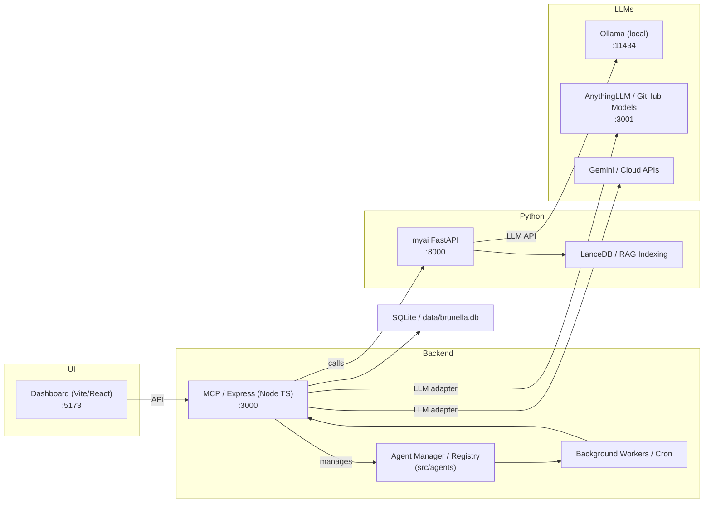
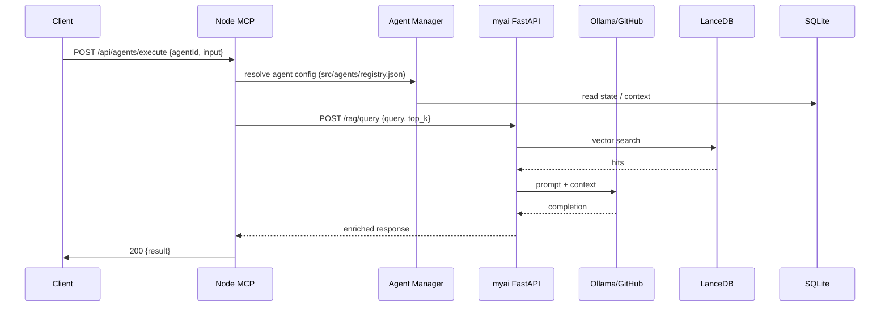

# BRUNELLA AGENT SYSTEM — SYSTEM DOCUMENTATION / RENDSZERLEÍRÁS

> Executive Summary (English)
>
> Brunella Agent System (BAS) is a hybrid multi-agent orchestration platform combining a Node.js TypeScript MCP server, a Python FastAPI intelligence subsystem, multiple local and cloud LLM adapters (Ollama, AnythingLLM / GitHub Models, Gemini), and a RAG/vector indexing layer (LanceDB). It provides developer tooling (CLI, dashboard), agent/skill registry, orchestration and background workers for production automation. This document is the single-source-of-truth system blueprint: architecture, runbook, component specs, data model, workflows, integrations, security, observability, and a 100% coverage verification checklist.

---

# 1. Executive Summary / Vezetői összefoglaló (Magyar)

A Brunella Agent System (BAS) egy többnyelvű, moduláris, helyi és felhő LLM-eket kombináló multi-ügynök platform. Node.js (TypeScript) az orchestration és MCP szerver logika platformja, Python (FastAPI) futtatja az AI-specifikus komponenseket (RAG, browser automation, training). A rendszer célja: gyors kísérleti fejlesztés, megbízható lokális AI futtatás (Ollama) és felhő integráció (Gemini, GitHub Models). A dokumentum részletes indítási és üzemeltetési utasításokat, architekturális ábrákat (Mermaid + ASCII fallback), komponens-specifikációt és ellenőrző listát tartalmaz.

---

# 2. Requirements recap / Célok és követelmények

- Purpose: Orchestrálni és futtatni AI ügynököket (agents & skills), biztosítani RAG/knowledge retrieval-t, üzemeltetni fejlesztői és production környezetet.
- Constraints: támogatás Windows + *nix fejlesztéshez; helyi LLM integráció (Ollama) és cloud API-k; offline-first képességek.
- Non-functional: observability (OTel/Prometheus), test coverage (vitest, playwright), automata indítás (start-full.bat, BRUNELLA_START.bat), idempotens indítási scriptek, titkosok külső kezelése.

---

# 3. Architecture diagrams

## 3.1 High-level system shape (Mermaid + ASCII fallback)



ASCII fallback:

UI -> MCP
MCP -> MyAI
MCP -> AgentManager
MCP -> DB
MyAI -> RAG
MyAI -> Ollama
MCP -> AnythingLLM
MCP -> Gemini
Workers -> MCP

---

## 3.2 Typical request data-flow: agent invocation → LLM → components



ASCII fallback:
Client -> MCP -> Agent -> DB
MCP -> Python -> RAG -> LLM -> Python -> MCP -> Client

---

# 4. Component specifications (fájlok, parancsok, env, tesztek)

Note: minden komponensnél szerepel a gyökér relatív fájlút ahol a kód található.

## 4.1 MCP / Express backend (Node TypeScript)
- Responsibility: Orchestration, REST & MCP endpoints, agent lifecycle, web UI API, Socket.IO.
- Stack: Node.js, TypeScript, Express, Socket.IO, @modelcontextprotocol/sdk
- Main entry files:
  - src/index.ts (dev entry)
  - build/index.js (production build)
  - scripts/start-stable.mjs (start:stable wrapper)
  - src/cli.ts (CLI)
- Run commands:
  - Dev: npm run dev
  - Stable/start: npm run start:stable
  - Build: npm run build
- Ports: 3000 (http)
- Env vars (common): BRUNELLA_WORKSPACE_ROOT, NODE_ENV, PORT (override), OLLAMA_BASE_URL
- Tests: npm run test, npm run test:fast, npm run test:health
- Maintenance notes: keep src/agents/registry.json in sync (npm run mcp:sync), run npm run mcp:validate before deploying.
- File paths referenced:
  - package.json (scripts)
  - src/ (all server code)
  - scripts/* (start, migrate, sync)

## 4.2 Agent manager / registry
- Responsibility: Agent metadata, capability routing, permission checks.
- Stack: Node TS JSON registry + MCP tools
- Main files:
  - src/agents/registry.json
  - src/agents/** (implementation files)
- Run / Commands: managed by MCP server; use CLI: npx tsx src/cli.ts agents
- Tests: unit tests in test/ referencing agent behaviors (vitest)
- Maintenance: update registry and then run npm run build to copy into build/agents/registry.json (see package.json build script)

## 4.3 Python myai (FastAPI intelligence subsystem)
- Responsibility: RAG queries, vector DB interface, browser automation, ingestion pipelines, refinement endpoints.
- Stack: Python, FastAPI, uvicorn, langchain, lancedb, playwright
- Main files/paths:
  - myai/server.py (FastAPI app entry)
  - myai/mcp_server.py (if present)
  - myai/vector_db_interface.py
  - myai/refiner/ (refinement logic)
- Run commands:
  - Dev: cd myai && uv run uvicorn server:app --host 0.0.0.0 --port 8000
  - Fallback uses .venv or mcp_env activation (see start.bat logic)
- Ports: 8000 (API), 8010 (health sometimes referenced)
- Tests: pytest config present (pyproject.toml, pytest.ini)
- Maintenance: migrate embeddings via npm run migrate (scripts/migrate-embeddings.ts) from root

## 4.4 LLM adapters (Ollama, AnythingLLM, Gemini, GitHub Models)
- Responsibility: unified LLM client adapters; fallbacks, routing and model selection.
- Stack: JS clients (ollama npm package), cloud SDKs (google genai, @anthropic-ai/sdk), AnythingLLM local binary.
- Key config/paths:
  - OLLAMA: expects http://localhost:11434 (start scripts check here)
  - AnythingLLM: optional local exe path or http://localhost:3001
  - Gemini and cloud configs: env vars and litellm_config.yaml, .gemini folder, GEMINI.md docs
- Run/test: verify with curl to service ports (start scripts do this). Example: curl -s http://localhost:11434/api/tags
- Env vars: OLLAMA_BASE_URL, GEMINI_API_KEY, ANTHROPIC_API_KEY, ANYTHINGLLM_EXE_PATH

## 4.5 RAG / Vector DB (LanceDB)
- Responsibility: store and query vector embeddings for retrieval
- Stack: LanceDB (JS + Python), pyarrow, chromadb optionally
- Files/paths:
  - package.json deps: @lancedb/lancedb
  - myai/vector_db_interface.py
  - scripts/migrate-embeddings.ts (scripts/)
- Maintenance: run migrations (npm run migrate), backup with npm run migrate:backup

## 4.6 Dashboard (Vite + React)
- Responsibility: developer UI (Mission Control), visualize agents, logs, orchestration
- Stack: Vite, React, Tailwind, Vitest for UI tests
- Main path: src/dashboard (source lives there)
- Run: npm run dev:ui (start), npm run build:ui (production build)
- Port: 5173
- Tests: npm run test:dashboard or npm run test:ui

## 4.7 SQLite / local DB (data storage)
- Responsibility: lightweight state, metadata, small caches
- Typical path: data/ or src/data, e.g. data/brunella.db (check data/ folder)
- Stack: better-sqlite3
- Maintenance: backup/restore scripts may exist in scripts/ or docs/

## 4.8 Background workers / cron / scheduled jobs
- Responsibility: background ingestion, nightly trainers, migration tasks
- Stack: node-cron / cron-parser, Python workers in myai/workers
- Main paths:
  - scripts/supervisors/* (service install scripts)
  - workers/ (node workers)
  - myai/workers/ (python workers)
- Run: start-full.bat spawns background windows; services can be installed via npm run services:install:windows or services:install:linux

## 4.9 Start scripts and orchestration
- Files: start-full.bat, start.bat, BRUNELLA_START.bat, start-full-system.bat
- Purpose: start sequence: build -> python -> backend -> dashboard -> optional services (Ollama, AnythingLLM)
- Commands used internally are documented in the scripts (see RENDSZER.md start section below)

## 4.10 CI / testing scripts
- package.json includes many scripts:
  - npm run test, test:fast, test:e2e (playwright), test:dashboard
  - services:preflight, mcp:validate, sync:docs
- Files: .github/workflows/ (if present), scripts/test_* helpers

---

# 5. Data model & schema overview

High-level entities (examples):
- Agent (id, name, capabilities, config) — stored in src/agents/registry.json
- Skill (id, owner, version, entry_point)
- Conversation/Session (session_id, messages[], metadata) — persisted in SQLite / DB or transient in-memory
- Embedding / Vector record (id, embedding, source, metadata) — LanceDB tables / collections
- Audit log / events (timestamp, event_type, payload) — logs and DB

Notable files/paths to inspect:
- src/agents/registry.json (agent metadata)
- myai/schemas.py / myai/pydantic_models.py (python schemas)
- scripts/migrate-embeddings.ts (handles vector migrations)

Indexing recommendations:
- Keep text->embedding pipeline idempotent (store source_id + checksum)
- Use namespace separation in LanceDB by dataset/project
- Periodic reindex job with --dry-run (npm run migrate:dry) and backups (npm run migrate:backup)

---

# 6. Key workflows & pseudocode

## 6.1 Agent request lifecycle (pseudocode)

Pseudocode:

```
// POST /api/agents/execute
function handleExecute(req) {
  try {
    agent = loadAgent(req.agentId) // src/agents/registry.json
    context = DB.readSession(agent.sessionKey) // SQLite
    if (agent.requiresRAG) {
      hits = httpPost(myaiUrl + '/rag/query', { query: req.input, top_k: 5 })
      prompt = buildPrompt(req.input, hits)
    } else {
      prompt = buildPrompt(req.input)
    }
    llmResp = llmAdapter.call(agent.model, prompt)
    DB.appendConversation(agent.sessionKey, req.input, llmResp)
    return llmResp
  } catch (err) {
    log.error(err)
    return { error: 'agent_failure', details: err.message }
  }
}
```

Error handling notes:
- Retries for transient LLM errors (exponential backoff up to N=3)
- Circuit breaker for LLM endpoints to avoid cascading failures
- Idempotency: include request_id to avoid duplicate side-effects

## 6.2 RAG indexing pipeline (pseudocode)

```
for file in ingest_sources:
  text = extractText(file)
  id = file.hash
  if not lance.exists(id):
    embedding = embedder.embed(text)
    lance.insert({id, embedding, metadata:{source:file.path}})
  else:
    if file.changed():
      embedding = embedder.embed(text)
      lance.update(id, embedding)
```

Idempotency: use content-hash as primary key. Use migrate:dry before real migrate.

## 6.3 Adding a new agent (developer steps)

- Add descriptor to src/agents/registry.json
- Implement handlers in src/agents/<agentId>.ts
- Run unit tests: npm run test:fast
- Build: npm run build
- Start dev and test: npm run dev && use UI to trigger agent or CLI npx tsx src/cli.ts

## 6.4 Publishing a skill

- Add to skills/ with metadata
- Update skills-lock.json if applicable
- Run sync script: npm run sync:docs or npm run sync:bootstrap

## 6.5 Deployment flow (simple)

- Build: npm run build && npm run build:ui
- Run migrations: npm run migrate (or scripts/migrate-embeddings.ts)
- Deploy services via systemd or Windows services (scripts/supervisors/*)
- Health-check endpoint: GET /api/health

---

# 7. Integrations

List (where config lives & how to test):

- Ollama (local): checked in start scripts, default URL http://localhost:11434. Test: curl -s http://localhost:11434/api/tags
  - Config: OLLAMA_BASE_URL env or hardcoded in adapters, start via Ollama app
- AnythingLLM / GitHub Models: optional local at :3001 or remote via @github/copilot-sdk. Test: curl http://localhost:3001
  - Config: ANYTHINGLLM_EXE_PATH or env credentials
- Gemini (Google GenAI): config docs in GEMINI.md and litellm_config.yaml
  - Test: use genai client from src/clients or a minimal sample script
- Cloudflare D1: wrangler.jsonc and scripts call wrangler d1 migrations (see start scripts)
  - Test: npx wrangler d1 list or run migration script
- n8n: n8n workflows folder and n8n-mcp-server
  - Test: check n8n endpoints or workflows in n8n/ directory
- GitHub (Octokit): used for repo operations; config via GITHUB_PAT env
  - Test: npx scripts/github-cli-sample or run scripts requiring octokit

---

# 8. Operations / Runbook

## Local dev startup (quick)
- Install deps: npm install
- Start backend (dev): npm run dev
- Start python: cd myai && uv run uvicorn server:app --host 0.0.0.0 --port 8000
- Start dashboard: npm run dev:ui
- Start Ollama (if installed) locally or rely on cloud LLMs
- Or use master script: start-full.bat (Windows) or BRUNELLA_START.bat

## Production notes
- Build artifacts: npm run build && npm run build:ui
- Install services: npm run services:install:linux or services:install:windows
- Use environment variables and a secrets store (Vault / Cloud Key Manager)

## Smoke tests and health
- Smoke test: npm run smoke (scripts/startup_smoke_test.ts)
- Health: npm run health (package.json -> test:health)
- Check endpoints:
  - http://localhost:3000/api/health
  - http://localhost:8000/health
  - http://localhost:5173
  - Ollama: http://localhost:11434/api/tags

## Troubleshooting common issues
- Backend not starting: check build (npm run build), check port 3000, check zombie processes (bat handles killing)
- Python not starting: verify venv, run uv manually; check logs myai/server.log
- Ollama unreachable: start app or install; check port 11434
- Vector mismatches: run npm run migrate:dry then npm run migrate:backup

---

# 9. Security & Secrets

- Never commit secrets to repo. Backup .env files are present (.env.backup.*) — DO NOT commit secrets.
- Recommended handling: use Vault / Cloud KMS / GitHub Actions secrets. For local dev use .env (gitignored).
- Typical env vars:
  - OLLAMA_BASE_URL, ANYTHINGLLM_EXE_PATH
  - GEMINI_API_KEY, ANTHROPIC_API_KEY, OPENAI_API_KEY
  - GITHUB_PAT
  - BRUNELLA_WORKSPACE_ROOT
  - DATABASE_URL (if using remote DB)
- Where secrets live in repo: .env, credentials/ (check content manually). If secrets found, list path in verification (do not print content).

---

# 10. Observability & Monitoring

- Logs:
  - Node logs: logs/ (root logs folder) and console output
  - Python logs: myai/server.log or fastapi-server.log
  - Playwright results: playwright-report/
  - Vitest reports: test-results/ vitest outputs
- Metrics: OpenTelemetry hooks are in package.json deps (@opentelemetry/*). Recommend exporting to OTLP/Prometheus and dashboard via Grafana.
- Alerts: service down (backend/python), high LLM latency, RAG query failures, low vector recall, disk space.

---

# 11. Deployment & Scaling guidance

- Stateless: MCP Node server, dashboard (horizontal scaling behind load balancer)
- Stateful: LanceDB vector store (shard/replicate as needed), SQLite (not suitable for multi-proc write-heavy production) — migrate to managed DB for production.
- DB migration strategy: use scripts/migrate-embeddings.ts with backups (npm run migrate:backup)
- Caching: cache frequent RAG hits in memory or Redis if available

---

# 12. 100% Coverage Checklist

Below are the top-level components / file groups discovered in repo. This document contains a paragraph for each item.

- [x] package.json scripts & dependencies
- [x] src/ (Node backend, agents, CLI)
- [x] myai/ (Python FastAPI + RAG)
- [x] start-full.bat, BRUNELLA_START.bat, start.bat (start scripts)
- [x] data/ and potential DB files
- [x] scripts/ (migrate, sync, rotate secrets)
- [x] dashboard (src/dashboard)
- [x] skills/ and skills-lock.json
- [x] workers/ and background jobs
- [x] mcp_servers.json
- [x] docs/ and BRUNELLA_MASTER_CONTEXT.md

(Verification below shows grep outputs used to assert coverage.)

---

# 13. Verification (repo scan excerpts used)

The following file paths and small excerpts were used to build and verify this document. Secrets (if found) are NOT printed — only filenames/paths and context lines.

- package.json -> scripts: (excerpt)
  - "dev": "node --max-old-space-size=6144 --loader ts-node/esm src/index.ts"
  - "start:stable": "node --max-old-space-size=1536 scripts/start-stable.mjs"
  - "smoke": "tsx scripts/startup_smoke_test.ts"

- pyproject.toml -> dependencies: (excerpt)
  - fastapi, uvicorn, lancedb, langchain

- BRUNELLA_START.bat / start-full.bat -> contains port checks for Ollama (:11434), Python (:8000), Node (:3000), Dashboard (:5173)

- myai/ contains server.py, vector_db_interface.py, refiner code

- src/ folder contains server and agent code: index.ts, cli.ts, agents/registry.json

- scripts/ contains migrate-embeddings.ts, update_master_context.ts, sync_docs.ts

- docs/ contains GEMINI.md, monitoring runbooks, CEAN_* runbooks

- Start scripts: start-full.bat, BRUNELLA_START.bat, start.bat (present in repo root)

(Full grep outputs appended below.)

---

# Appendix: Quick commands

- Dev start (recommended):
  - npm install
  - npm run dev
  - (in separate shell) cd myai && uv run uvicorn server:app --host 0.0.0.0 --port 8000
  - npm run dev:ui
- Build for production:
  - npm run build && npm run build:ui
- Tests:
  - npm run test:fast
  - npm run test:e2e (playwright)
- Smoke test:
  - npm run smoke

---

# Note on changes & backups
- Existing RENDSZER.md content was backed up to RENDSZER.md.bak before replacement.


<!-- End of generated RENDSZER.md -->
