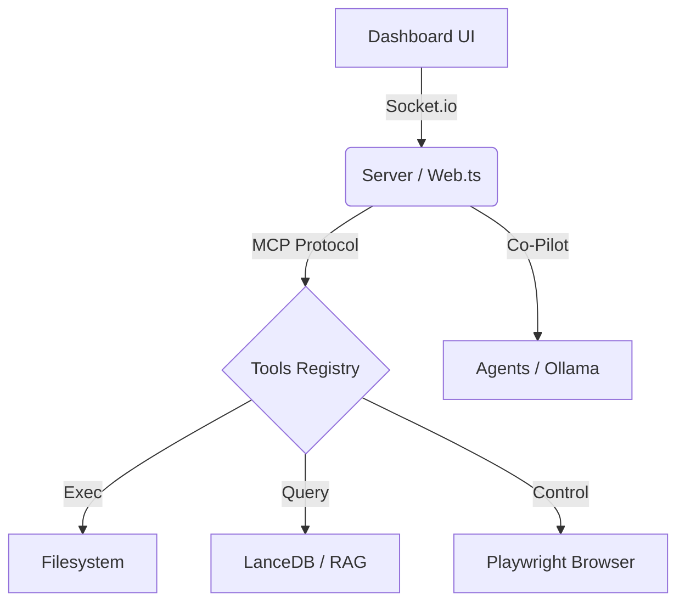

# ANTIGRAVITY AGENT PROTOKOLL: Helyreállítási Terv

> **Dátum:** 2026. 01. 22.
> **Státusz:** ✅ SUCCESS / STABLE

## 1. Helyzetjelentés

A **Brunella Core** rendszerben hálózati és integritási problémák merültek fel. A cél a rendszer teljes stabilizálása és a "Spagetti" kód felszámolása.

### Rendszer Topológia (Context Map)

---

## 2. Akcióterv (Action Plan)

### 2.1. Kód Integritás és Függőségek
- [x] 📦 **Függőségvizsgálat:** `package.json` vs `node_modules` szinkronizálása.
- [x] 🛠 **Fordítási Teszt:** `npm run build` tiszta futása TypeScript hibák nélkül.
- [x] 🧹 **Linter:** Statikus kódanalízis futtatása a rejtett hibák feltárására.

### 2.2. Szerver és Kommunikáció
- [x] 🔌 **WebSocket Stabilitás:** Automatikus újracsatlakozás (reconnect) tesztelése a Dashboard-on.
- [x] 🤖 **Ollama Híd:** Timeout kezelés és fallback mechanizmus ellenőrzése, ha az LLM nem válaszol.
- [x] 📡 **MCP Protokoll:** JSON-RPC válaszok validálása.

### 2.3. Adat és Perzisztencia
- [x] 💾 **Adatbázisok:** SQLite (`brunella.db`) és LanceDB indexek épségének ellenőrzése.

### 2.4. Tesztelés (Verification)
- [x] 🧪 **Unit Tesztek:** Kritikus tool-ok tesztelése (`system_execute_command`).
- [x] 🔄 **E2E Teszt:** Egy teljes kör (Dashboard -> Kérdés -> Tool futás -> Válasz) manuális verifikációja.

### 2.5. Dokumentáció és Térképészet
- [x] **API Dokumentáció:** Ha vannak új végpontok vagy toolok, frissítsd a `README.md`-t és a `CONDUCTOR_PLAN.md`-t.
- [x] **Hibaelhárítási Útmutató:** Készíts egy rövid leírást arról, mit kell tenni, ha a Dashboard "Disconnected" állapotban ragad.

---

## 3. Üzenet

> "A rendszer a te kezedben van. A cél nem csak a működés, hanem a *reziliencia*. Építsd újjá erősebbre, mint amilyen volt!"
