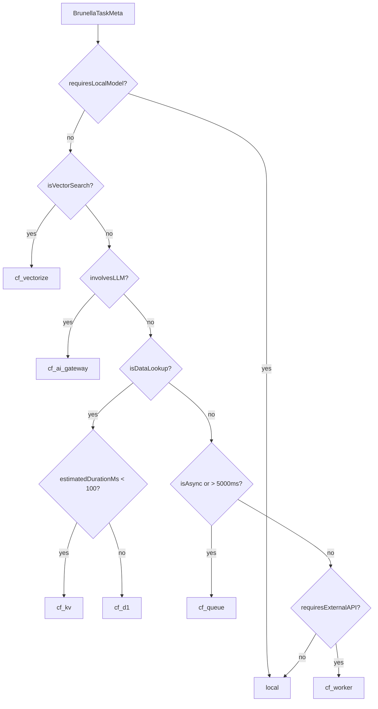

# CF Dispatch Guide

## Decision flow



## Target mapping

| Task shape | Target |
| --- | --- |
| Local Ollama work | `local` |
| Semantic search / embeddings | `cf_vectorize` |
| LLM proxying / cached model calls | `cf_ai_gateway` |
| Fast key lookup or write | `cf_kv` |
| Structured query | `cf_d1` |
| Async or long-running task | `cf_queue` |
| External API work | `cf_worker` |

## Adding a new task type

1. Extend `BrunellaTaskMeta` if the task needs a new flag.
2. Add a rule in `src/cloudflare/CFDispatcher.ts`.
3. Add a matching test case in `src/cloudflare/CFDispatcher.test.ts`.
4. If the Worker needs a new execution path, add it to `bas-cloudflare-orchestrator/src/index.ts`.
5. Keep the route and Worker log entries aligned so the same task type is auditable end to end.

## dispatch_log examples

```sql
SELECT *
FROM dispatch_log
ORDER BY created_at DESC
LIMIT 20;
```

```sql
SELECT target, COUNT(*) AS total, SUM(success) AS success_count
FROM dispatch_log
GROUP BY target
ORDER BY total DESC;
```

```sql
SELECT agent_name, task_type, target, reason, success, latency_ms, created_at
FROM dispatch_log
WHERE success = 0
ORDER BY created_at DESC;
```
