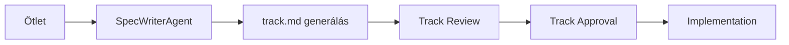

# Engineering Precision Protocol v2 (EPP v2)

**Version:** 2.0
**Effective Date:** 2026-02-11
**Status:** ACTIVE

## 📖 Áttekintés

Az Engineering Precision Protocol v2 (EPP v2) a Brunella Agent System fejlesztési protokollja. Célja a kódbázis minőségének fenntartása, a fejlesztési folyamat átláthatósága és a hibák minimalizálása.

**Legfontosabb változás v1-ről v2-re:**
- ✅ **Dashboard + CLI integráció minden funkcióhoz kötelező!**

---

## 🎯 Alapelvek

1. **Track-Based Development** - Minden funkció track-ből indul
2. **Zero-Error Strategy** - Minden commit előtt: build ✅ + test ✅
3. **Documentation First** - Kód előtt dokumentáció
4. **Mandatory Integration** - Dashboard + CLI minden funkcióhoz
5. **Continuous Testing** - Tesztek futnak minden változás után

---

## 📜 A 7 Arany Szabály

### 1️⃣ NINCS KÓDÍRÁS TRACK NÉLKÜL ❌→✅

**Szabály:**
- Ad-hoc kódolás tiltott
- Minden új funkció = `conductor/tracks/<name>/track.md`
- SpecWriterAgent használata (kreatív ötlet → professzionális track)

**Miért?**
- Megelőzi a "spaghetti" fejlesztést
- Biztosítja a dokumentációt
- Lehetővé teszi a progress tracking-et

**Track létrehozás folyamata:**



**Track Template:**

```markdown
# Track: <Feature Name>

**Status:** PROPOSED | IN_PROGRESS | TESTING | COMPLETED
**Priority:** P0 (CRITICAL) | P1 (HIGH) | P2 (MEDIUM) | P3 (LOW)
**Complexity:** LOW | MEDIUM | HIGH
**Created:** YYYY-MM-DD
**Owner:** <Agent Name>

## 🎯 Cél
<Rövid leírás>

## 🤔 User Story
As a <role>, I want <goal> so that <benefit>.

## ✅ Acceptance Criteria
1. [ ] Criterion 1
2. [ ] Criterion 2
3. [ ] Criterion 3

## 🎨 Dashboard Integráció (KÖTELEZŐ!)
- [ ] React komponens létrehozva: `src/dashboard/components/<Feature>.tsx`
- [ ] Radix UI + Tailwind használat
- [ ] Responsive design (mobile-first)
- [ ] Real-time adatok (WebSocket vagy polling)
- [ ] Error handling + loading states

## 🖥️ CLI Integráció (KÖTELEZŐ!)
- [ ] Magyar menüpont: `src/cli/commands/<feature>-hu.ts`
- [ ] Inquirer.js menü (nyíl + enter navigáció)
- [ ] Interaktív kiválasztás (NINCS begépelés!)
- [ ] Színes output (chalk, boxen)
- [ ] Hibakezelés + user feedback

## 🔧 Technical Requirements
### Agent
- Agent: <AgentName>
- Methods: `executeFeature()`, etc.

### Backend (ha szükséges)
- API Endpoint: `POST /api/v1/<resource>`
- Database: SQLite / LanceDB / etc.
- WebSocket: `<event-name>` (ha real-time)

### Testing
- [ ] Unit tesztek: `test/<feature>.test.ts`
- [ ] E2E tesztek: `test/e2e/<feature>.e2e.test.ts`
- [ ] Coverage: 80%+

## 📋 Implementation Plan
### Phase 1: <Phase Name>
- [ ] Task 1
- [ ] Task 2

### Phase 2: <Phase Name>
- [ ] Task 1
- [ ] Task 2

## 🐛 Bugs Fixed During Development
- BUG-001: <Description> → Fixed in commit <hash>

## 📝 Documentation
- [ ] README.md frissítés
- [ ] .ai/FOSZAL.md frissítés
- [ ] API Docs (ha új endpoint)

## 🎉 Final Checklist
- [ ] npm run build ✅
- [ ] npm test ✅ (100%)
- [ ] Manual testing ✅
- [ ] Dashboard component working ✅
- [ ] CLI command working ✅
- [ ] Git commit pushed ✅
- [ ] .ai/<agent>.md frissítve ✅
- [ ] sync_foszal.py futtatva ✅
- [ ] tracks.md státusz frissítve ✅
```

**Példa jó track névre:**
- `cloudflare-chat-integration-20260211`
- `jules-async-test-automation-20260211`
- `spec-writer-agent-20260211`

---

### 2️⃣ HIBÁK KÖTELEZŐ JAVÍTÁSA 🐛

**Szabály:**
- Fejlesztés közben talált hibák **AZONNAL** javítandók
- Regression teszt hozzáadása (ne ismétlődjön!)
- Track.md "Bugs Fixed" szekció frissítése

**Miért?**
- Megelőzi a "technical debt" felhalmozódást
- Biztosítja a kódbázis stabilitását
- Javítja a tesztelési lefedettséget

**Bugfix workflow:**

```typescript
// 1. BUG ÉSZLELÉS
// Fejlesztés közben találsz egy hibát: AgentManager.executeTask() nem kezeli az üres task-okat

// 2. TRACK FRISSÍTÉS
// Hozzáadsz egy bejegyzést a track.md-hez:
// ## 🐛 Bugs Fixed During Development
// - BUG-001: AgentManager.executeTask() crashes on empty task string → Fixed in commit abc1234

// 3. TESZT ÍRÁSA (TDD!)
// test/agent_manager.test.ts:
describe('AgentManager.executeTask()', () => {
  it('should handle empty task gracefully', async () => {
    const result = await agentManager.executeTask('TestAgent', '');
    expect(result.status).toBe('error');
    expect(result.error).toContain('Task cannot be empty');
  });
});

// 4. JAVÍTÁS
// src/agents/AgentManager.ts:
async executeTask(agentName: string, task: string): Promise<AgentResponse> {
  if (!task || task.trim() === '') {
    return {
      status: 'error',
      error: 'Task cannot be empty',
      agent: agentName
    };
  }
  // ... rest of implementation
}

// 5. VERIFY
// npm test -- agent_manager.test.ts
// ✅ PASS

// 6. GIT COMMIT
// git add test/agent_manager.test.ts src/agents/AgentManager.ts
// git commit -m "fix(agent-manager): handle empty task string gracefully (BUG-001)"
```

**Mikor számít "major bug"-nak?**
- Crash / Exception
- Data loss
- Security vulnerability
- Performance regression (>50% lassulás)
- API contract breaking change

---

### 3️⃣ GITHUB COMMIT MINDEN MAJOR LÉPÉS UTÁN 📝

**Szabály:**
- Track Phase befejezése → Git commit
- Commit formátum: `feat(track-name): [phase] Brief description`
- Minden commit után: `npm test` MUST PASS

**Miért?**
- Atomic commits (easy revert)
- Clear history
- CI/CD integration

**Commit Message Konvenció:**

```bash
# Format
<type>(<scope>): <subject>

# Types
feat     - Új funkció
fix      - Bugfix
refactor - Kód átszervezés (no behavior change)
test     - Teszt hozzáadása/módosítása
docs     - Dokumentáció
chore    - Build/config változás

# Examples
feat(cloudflare-chat): [phase-1] Add WebSocket connection handler
feat(cloudflare-chat): [phase-2] Integrate D1 Database for message storage
fix(agent-manager): Handle empty task string gracefully (BUG-001)
test(dashboard): Add E2E tests for TrackProgress widget
docs(epp-v2): Create Engineering Precision Protocol v2 documentation
```

**Commit workflow:**

```bash
# 1. FINISH PHASE
# Befejezted Phase 1-et (WebSocket handler)

# 2. VERIFY
npm run build
# ✅ 0 errors

npm test
# ✅ 424/424 PASS

# 3. STAGE FILES
git add src/server/websocket.ts test/websocket.test.ts

# 4. COMMIT
git commit -m "feat(cloudflare-chat): [phase-1] Add WebSocket connection handler

- Implement WebSocket server (ws library)
- Add connection/disconnect handlers
- Add message broadcast functionality
- Unit tests: 5/5 PASS

Ref: conductor/tracks/cloudflare-chat-integration-20260211/"

# 5. PUSH
git push origin <branch-name>
```

**TILOS:**
- ❌ Commit nélkül hagyni egy befejezett Phase-t
- ❌ Failing tesztekkel commitolni
- ❌ "WIP", "temp", "fix" típusú commit üzenetek

---

### 4️⃣ TODO LISTA KÖTELEZŐ ✅

**Szabály:**
- Track.md checkbox lista frissítése folyamatosan
- CLI: `brunella tracks status <name>` (magyar)
- Dashboard: TODO widget real-time

**Miért?**
- Átlátható progress tracking
- Motiváció (checklist effect!)
- PM/PO számára is követhető

**TODO Menedzsment:**

```markdown
# Track: cloudflare-chat-integration-20260211

## 📋 Implementation Plan

### Phase 1: WebSocket Setup
- [x] Install ws library
- [x] Create WebSocket server
- [x] Add connection handler
- [ ] Add authentication middleware  <-- CURRENT
- [ ] Add rate limiting

### Phase 2: D1 Integration
- [ ] Create D1 schema
- [ ] Implement message persistence
- [ ] Add query helpers
```

**CLI Használat:**

```bash
# Track státusz lekérdezése
brunella tracks status cloudflare-chat-integration-20260211

# Output:
# 📊 Track Progress: cloudflare-chat-integration-20260211
# ━━━━━━━━━━━━━━━━━━━━━━━━━━━━━━━━━━━━━━━━━━━━━
# Status: IN_PROGRESS
# Progress: 3/10 (30%)
#
# ✅ Phase 1: WebSocket Setup (3/5)
#    ✅ Install ws library
#    ✅ Create WebSocket server
#    ✅ Add connection handler
#    ⏸️  Add authentication middleware  <-- CURRENT
#    ⏸️  Add rate limiting
#
# ⏸️  Phase 2: D1 Integration (0/3)
#    ⏸️  Create D1 schema
#    ⏸️  Implement message persistence
#    ⏸️  Add query helpers
```

**Dashboard Widget:**
- Real-time progress bar
- Checkbox interaktív toggle (klikk = frissít)
- WebSocket sync (több kliens egy időben)

---

### 5️⃣ MINDEN TESZT ZÖLD BEFEJEZÉSHEZ 🧪

**Szabály:**
- Track státusz **TESTING → COMPLETED** csak ha:
  - ✅ `npm run build` (0 errors)
  - ✅ `npm test` (100% PASS)
  - ✅ Manual testing (acceptance criteria)
  - ✅ Dashboard + CLI működik

**Miért?**
- Zero-Error Strategy
- Production-ready code
- No surprises in production

**Testing Checklist:**

```bash
# 1. BUILD
npm run build
# ✅ CLEAN (0 TypeScript errors)

# 2. UNIT TESTS
npm test
# ✅ 430/430 PASS (100%)

# 3. E2E TESTS (ha van)
npm run test:e2e
# ✅ 37/37 PASS

# 4. LINTING
npm run lint
# ✅ No issues

# 5. MANUAL TESTING
# - Dashboard: Open http://localhost:5173
#   - Feature widget látható ✅
#   - Interakció működik ✅
#   - Error handling működik ✅
# - CLI: brunella <feature-command>
#   - Magyar menü megjelenik ✅
#   - Navigáció működik ✅
#   - Output helyes ✅

# 6. ACCEPTANCE CRITERIA
# - [ ] Criterion 1 ✅
# - [ ] Criterion 2 ✅
# - [ ] Criterion 3 ✅
```

**Ha valamelyik fail → TESTING státuszban marad!**

**Példa COMPLETED transition:**

```markdown
# Track: cloudflare-chat-integration-20260211

**Status:** COMPLETED ✅
**Completed Date:** 2026-02-11 18:30

## ✅ Completion Report

### Build & Test
- npm run build: ✅ CLEAN
- npm test: ✅ 430/430 PASS
- npm run test:e2e: ✅ 37/37 PASS
- npm run lint: ✅ No issues

### Manual Testing
- Dashboard: CloudflareChat.tsx widget ✅
  - WebSocket connection working ✅
  - Message send/receive working ✅
  - D1 Database persistence ✅
- CLI: brunella chat (magyar) ✅
  - Chat interface working ✅
  - Message history loading ✅

### Acceptance Criteria
- [x] WebSocket chat működik Dashboard-on
- [x] D1 Database történet mentés működik
- [x] Magyar CLI chat interface működik
- [x] Real-time message sync működik

### Final Commit
- Commit: abc1234
- Message: "feat: Complete cloudflare-chat-integration-20260211"
```

---

### 6️⃣ DASHBOARD + CLI INTEGRÁCIÓ KÖTELEZŐ 🎨+🖥️

**⚠️ ÚJ SZABÁLY! (2026-02-11)**

**Szabály:**
- Minden új funkció **Dashboard komponenst** kap
- Minden új funkció **CLI parancsot** kap (magyar, menüvezérelt)
- Track.md checklist tartalmazza mindkettőt
- Ha valamelyik elmarad → Track **NEM** COMPLETED

**Miért?**
- Dual interface (GUI + CLI) minden funkcióhoz
- Magyar nyelv támogatás (CLI)
- Accessibility (van aki CLI-t preferál, van aki Dashboard-ot)

**Dashboard Komponens Követelmények:**

```typescript
// Példa: src/dashboard/components/CloudflareChat.tsx

import { Card, CardContent, CardHeader, CardTitle } from '@/components/ui/card';
import { Button } from '@/components/ui/button';
import { Input } from '@/components/ui/input';
import { useEffect, useState } from 'react';

export function CloudflareChat() {
  const [messages, setMessages] = useState<Message[]>([]);
  const [input, setInput] = useState('');
  const [ws, setWs] = useState<WebSocket | null>(null);

  useEffect(() => {
    // WebSocket connection
    const socket = new WebSocket('wss://chat-bas.peterpohanka.com/ws');
    socket.onmessage = (event) => {
      const msg = JSON.parse(event.data);
      setMessages(prev => [...prev, msg]);
    };
    setWs(socket);
    return () => socket.close();
  }, []);

  const sendMessage = () => {
    ws?.send(JSON.stringify({ text: input, user: 'dashboard' }));
    setInput('');
  };

  return (
    <Card>
      <CardHeader>
        <CardTitle>Cloudflare Chat</CardTitle>
      </CardHeader>
      <CardContent>
        <div className="space-y-4">
          {/* Message list */}
          <div className="h-96 overflow-y-auto">
            {messages.map((msg, i) => (
              <div key={i} className="p-2 border-b">
                <span className="font-bold">{msg.user}:</span> {msg.text}
              </div>
            ))}
          </div>

          {/* Input */}
          <div className="flex gap-2">
            <Input
              value={input}
              onChange={(e) => setInput(e.target.value)}
              placeholder="Type a message..."
              onKeyDown={(e) => e.key === 'Enter' && sendMessage()}
            />
            <Button onClick={sendMessage}>Send</Button>
          </div>
        </div>
      </CardContent>
    </Card>
  );
}
```

**Követelmények:**
- ✅ Radix UI + Tailwind használat
- ✅ Responsive design (mobile-first)
- ✅ Real-time adatok (WebSocket vagy polling)
- ✅ Error handling + loading states
- ✅ Accessibility (ARIA labels, keyboard navigation)

**CLI Parancs Követelmények:**

```typescript
// Példa: src/cli/commands/chat-hu.ts

import inquirer from 'inquirer';
import chalk from 'chalk';
import WebSocket from 'ws';

export async function chatCommand() {
  console.log(chalk.blue.bold('\n🔵 Cloudflare Chat - Magyar Interface\n'));

  const ws = new WebSocket('wss://chat-bas.peterpohanka.com/ws');

  ws.on('message', (data) => {
    const msg = JSON.parse(data.toString());
    console.log(chalk.green(`[${msg.user}]: ${msg.text}`));
  });

  while (true) {
    const { action } = await inquirer.prompt([{
      type: 'list',
      name: 'action',
      message: 'Válassz műveletet:',
      choices: [
        '📨 Üzenet küldése',
        '📜 Előzmények megtekintése',
        '🔙 Vissza'
      ]
    }]);

    if (action === '🔙 Vissza') break;

    if (action === '📨 Üzenet küldése') {
      const { message } = await inquirer.prompt([{
        type: 'input',
        name: 'message',
        message: 'Üzenet:'
      }]);

      ws.send(JSON.stringify({ text: message, user: 'cli' }));
      console.log(chalk.green('✅ Üzenet elküldve!'));
    }

    if (action === '📜 Előzmények megtekintése') {
      // Fetch history from D1
      const history = await fetchChatHistory();
      console.log(chalk.yellow('\n📜 Utolsó 10 üzenet:\n'));
      history.forEach((msg: any) => {
        console.log(chalk.gray(`[${msg.timestamp}] ${msg.user}: ${msg.text}`));
      });
    }
  }

  ws.close();
}
```

**Követelmények:**
- ✅ Magyar nyelv (menük, üzenetek)
- ✅ Inquirer.js menü (nyíl + enter navigáció)
- ✅ Interaktív kiválasztás (NINCS begépelés!)
- ✅ Színes output (chalk, boxen, ora)
- ✅ Hibakezelés + user feedback

**Track Checklist (KÖTELEZŐ TEMPLATE):**

```markdown
## 🎨 Dashboard Integráció
- [ ] React komponens létrehozva: `src/dashboard/components/<Feature>.tsx`
- [ ] Radix UI + Tailwind használat
- [ ] Responsive design
- [ ] Real-time adatok (WebSocket/polling)
- [ ] Error handling + loading states

## 🖥️ CLI Integráció
- [ ] Magyar menüpont: `src/cli/commands/<feature>-hu.ts`
- [ ] Inquirer.js menü (nyíl + enter)
- [ ] Interaktív kiválasztás (NO typing!)
- [ ] Színes output (chalk, boxen)
- [ ] Hibakezelés + feedback
```

---

### 7️⃣ FINAL COMMIT + DOCS 🎉

**Szabály:**
- Track COMPLETED után:
  1. Git commit: `feat: Complete <track-name>`
  2. Update `.ai/<agent>.md`
  3. Run `python scripts/sync_foszal.py`
  4. Update `conductor/tracks.md` status

**Miért?**
- Dokumentáció naprakész marad
- FOSZAL.md egyesített napló frissül
- Tracks.md progress követhető

**Final Workflow:**

```bash
# 1. FINAL COMMIT
git add .
git commit -m "feat: Complete cloudflare-chat-integration-20260211

✅ WebSocket chat integration
✅ D1 Database persistence
✅ Dashboard component (CloudflareChat.tsx)
✅ CLI magyar interface (chat-hu.ts)
✅ All tests passing (430/430)

Track: conductor/tracks/cloudflare-chat-integration-20260211/
Co-Authored-By: Claude Sonnet 4.5 <noreply@anthropic.com>"

git push origin main

# 2. UPDATE .ai/<agent>.md
# Példa: .ai/claude.md
```

**.ai/claude.md frissítés:**

```markdown
# Claude Munkamenet Napló

**Utolsó frissítés:** 2026-02-11 18:45

## Utolsó Feladatok (2026-02-11)

### ✅ Cloudflare Chat Integráció KÉSZ! 🎉
- **Track:** cloudflare-chat-integration-20260211
- **Időtartam:** 2 óra
- **Eredmény:**
  - WebSocket chat működik Dashboard-on
  - D1 Database történet mentés
  - Magyar CLI chat interface
  - All tests passing (430/430)
- **Commit:** abc1234
- **Fájlok:**
  - src/dashboard/components/CloudflareChat.tsx (120 sor)
  - src/cli/commands/chat-hu.ts (85 sor)
  - src/server/websocket.ts (60 sor)
  - test/cloudflare-chat.test.ts (45 sor)

## Következő Lépések
- [ ] SpecWriterAgent implementáció
- [ ] Magyar CLI menürendszer átírás
```

```bash
# 3. RUN SYNC_FOSZAL
python scripts/sync_foszal.py

# Output:
# ✅ 80 entries processed
# ✅ .ai/FOSZAL.md updated
```

```bash
# 4. UPDATE conductor/tracks.md
# Manuálisan vagy CLI-vel:
brunella tracks complete cloudflare-chat-integration-20260211
```

**conductor/tracks.md frissítés:**

```markdown
## 🟢 Aktív Szálak

- [x] **💬 Cloudflare Chat Integration** [P1 - HIGH] ✅ COMPLETED!
  - **ID:** `cloudflare-chat-integration-20260211`
  - **Progress:** 100%
  - **Completed:** 2026-02-11 18:45
  - **Leírás:** Cloudflare Workers WebSocket chat beágyazása Dashboard-ba + CLI chat interface.
  - 📂 _[./tracks/cloudflare-chat-integration-20260211/](./tracks/cloudflare-chat-integration-20260211/)_
```

---

## 📊 EPP v2 Quick Reference

| Szabály | Rövid Leírás | Mikor? |
|---------|--------------|--------|
| 1️⃣ Track Required | Nincs kódírás track nélkül | Új feature kezdés előtt |
| 2️⃣ Fix Bugs | Hibák azonnal javítandók | Fejlesztés közben |
| 3️⃣ Commit Often | Major lépés = commit | Phase befejezése után |
| 4️⃣ TODO List | Checkbox lista frissítés | Folyamatosan |
| 5️⃣ All Tests Green | 100% teszt pass kell | Track COMPLETED előtt |
| 6️⃣ Dashboard + CLI | Mindkettő kötelező | Új feature implementáláskor |
| 7️⃣ Final Docs | Docs + FOSZAL frissítés | Track befejezése után |

---

## 🛠️ Tools & Commands

```bash
# Track létrehozás (SpecWriterAgent)
brunella tracks generate "<creative idea>"

# Track státusz
brunella tracks status <track-name>

# Track befejezés
brunella tracks complete <track-name>

# Build & Test
npm run build && npm test

# FOSZAL sync
python scripts/sync_foszal.py

# CLI menü (magyar)
brunella
```

---

## 🚨 Gyakori Hibák (Anti-Patterns)

| ❌ Rossz | ✅ Jó |
|---------|-------|
| Ad-hoc kódolás track nélkül | Track létrehozás előbb |
| Hibák ignorálása | Azonnali javítás + teszt |
| Ritkán commitolni | Minden Phase után commit |
| TODO lista elhanyagolása | Folyamatos checkbox frissítés |
| Dashboard VAGY CLI | Dashboard ÉS CLI mindkettő |
| Failing tesztekkel commitolni | All tests green before commit |
| Docs frissítés elmaradása | FOSZAL + agent.md mindig frissül |

---

## 📝 Track Template (Teljes)

Lásd fentebb: [Track Template](#1️⃣-nincs-kódírás-track-nélkül-❌→✅)

---

## 🔗 Kapcsolódó Dokumentumok

- `README.md` - Projekt master dokumentum
- `.ai/FOSZAL.md` - Egyesített munkamenet napló
- `conductor/tracks.md` - Track progress overview
- `conductor/workflow.md` - Data Flywheel, Phoenix Protocol

---

**Verzió történet:**

| Verzió | Dátum | Változások |
|--------|-------|-----------|
| v2.0 | 2026-02-11 | ✅ Dashboard + CLI kötelező integráció |
| v1.0 | 2026-02-05 | Kezdeti verzió (6 szabály) |

---

**Készítette:** Claude Sonnet 4.5
**Track:** `epp-v2-protocol-20260211`
**Status:** ✅ ACTIVE
