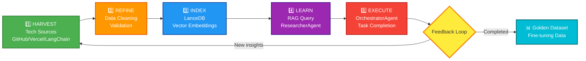
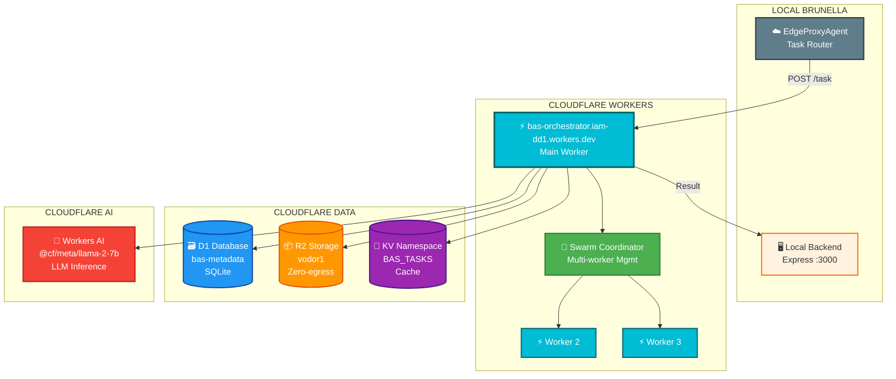
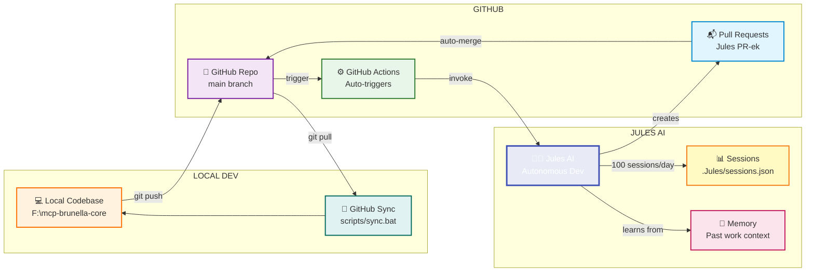
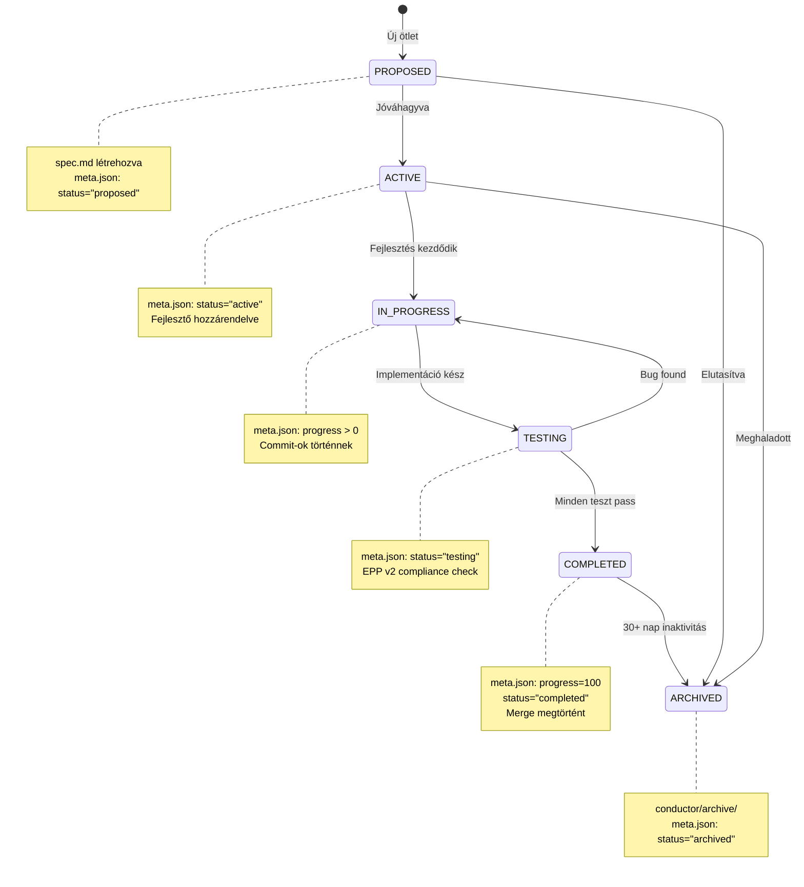
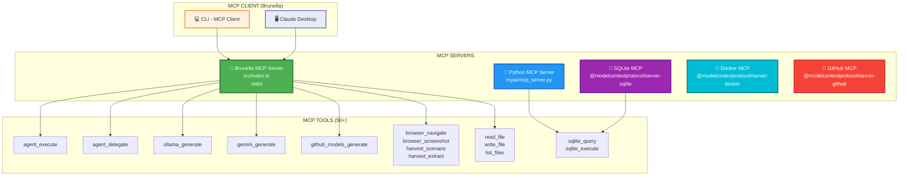
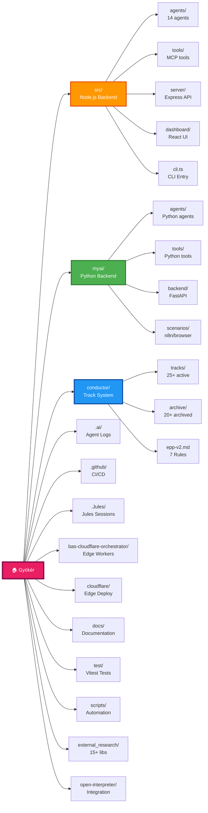
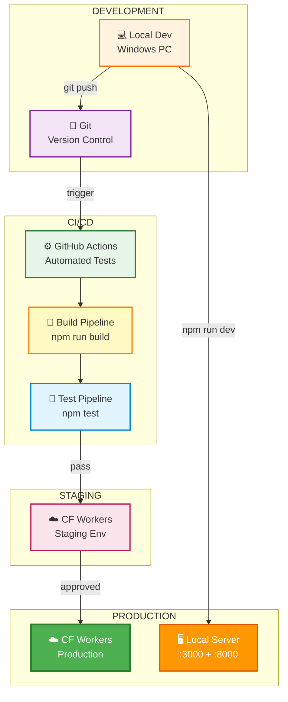
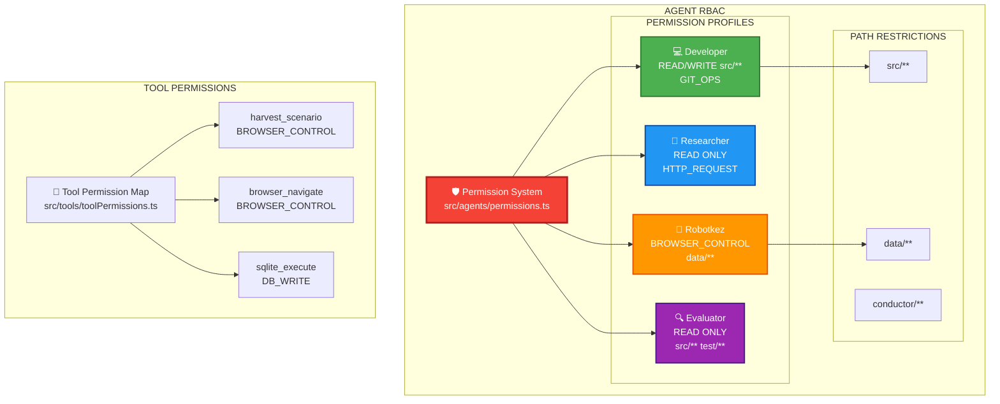

# 🏗️ BRUNELLA AGENT SYSTEM - TELJES ARCHITEKTÚRA DIAGRAM

**Generálva:** 2026-02-14
**Verzió:** 2.3.0
**Állapot:** Production-ready

---

## 📊 NAGY KÉP - Teljes Rendszer Topológia

```mermaid
graph TB
    subgraph "🖥️ USER LAYER"
        USER[👨‍💻 Felhasználó<br/>Kreatív/Stratégiai]
        CLI[💻 CLI<br/>brunella chat/agents/conductor]
        DASHBOARD[🎨 Dashboard<br/>React UI :5173]
    end

    subgraph "🧠 NODE.JS BACKEND - Port 3000"
        EXPRESS[⚡ Express Server<br/>REST API + Socket.IO]
        MCP_SERVER[📡 MCP Server<br/>StdioServerTransport]
        ORCHESTRATOR[🎯 OrchestratorAgent<br/>Top-level Planner]

        subgraph "14 AI AGENTS"
            DEV[💻 DeveloperAgent<br/>Code Gen/Test/Fix]
            EVAL[🔍 EvaluatorAgent<br/>Audit/Review]
            RESEARCH[🔬 ResearcherAgent<br/>Web Search/RAG]
            DATA_SCI[📊 DataScientistAgent<br/>Data Processing]
            SPEC[📝 SpecWriterAgent<br/>Auto Spec Gen]
            CONDUCTOR[📋 ProjectConductor<br/>Track Management]
            EDGE_PROXY[☁️ EdgeProxyAgent<br/>CF Routing]
            ROBOTKEZ[🤖 RobotkezAgent<br/>Browser Auto]
            VOICE[🎤 VoiceAgent<br/>Speech/Whisper]
            LINT[🔧 LintFixerAgent<br/>Auto Lint Fix]
            DEP_GRAPH[📈 DependencyGraphAgent<br/>Dep Analysis]
            PYTHON_AGENT[🐍 PythonAgent<br/>Python Monitor]
            DOCS_INTEL[📖 DocsIntelligence<br/>Docs Check]
            TASK_DECOMP[🧩 TaskDecomposer<br/>Task Breakdown]
        end

        subgraph "50+ API ROUTES"
            ROUTES_AGENTS[/agents/execute]
            ROUTES_TRACKS[/tracks/generate]
            ROUTES_CF[/cloudflare/task]
            ROUTES_ROBOTKEZ[/robotkez/execute]
            ROUTES_HEALTH[/health]
        end

        AGENT_MANAGER[🎛️ AgentManager<br/>Registry + Dispatcher]
        TASK_QUEUE[📥 Task Queue<br/>SQLite]
    end

    subgraph "🐍 PYTHON BACKEND - Port 8000"
        FASTAPI[⚡ FastAPI Server<br/>REST API]

        subgraph "PYTHON AGENTS & TOOLS"
            TECH_HARVEST[🌐 Tech Harvester<br/>Web Scraping]
            KNOWLEDGE_INT[🧠 Knowledge Integrator<br/>LLM Summary]
            HARVEST_PIPE[🔄 Harvest Pipeline<br/>End-to-End]
            BROWSER_WORKER[🖱️ Browser Worker<br/>Playwright/Browser-Use]
            REFINER[🔧 Data Refiner<br/>Cleaning + Validation]
        end

        MCP_PYTHON[📡 Python MCP Server]
    end

    subgraph "🗄️ DATA LAYER"
        LANCEDB[(🗃️ LanceDB<br/>Vector RAG)]
        SQLITE[(💾 SQLite<br/>Task Queue/Audit)]
        CHROMADB[(🔵 ChromaDB<br/>Optional RAG)]
        GOLDEN_DS[📊 Golden Dataset<br/>training_data.jsonl]
        SCENARIOS[📄 Scenarios<br/>n8n/browser JSON]
    end

    subgraph "🤖 LOCAL LLM - Port 11434"
        OLLAMA[🦙 Ollama<br/>18 models]
        MODELS[llama3.1:8b<br/>qwen2.5-coder<br/>deepseek-coder<br/>mistral]
    end

    subgraph "🌐 EXTERNAL LLM"
        GEMINI[💎 Gemini 2.0<br/>Google Cloud]
        GITHUB_MODELS[🐙 GitHub Models<br/>GPT-4o/o1-preview]
        CLAUDE_API[🧠 Claude API<br/>Sonnet 4.5]
    end

    subgraph "☁️ CLOUDFLARE EDGE"
        CF_WORKER[⚡ Workers<br/>bas-orchestrator]
        CF_D1[(🗃️ D1 SQLite<br/>bas-metadata)]
        CF_R2[(📦 R2 Storage<br/>vodor1)]
        CF_KV[(🔑 KV Cache<br/>BAS_TASKS)]
        CF_AI[🤖 Workers AI<br/>LLM Inference]
        SWARM_COORD[🐝 Swarm Coordinator<br/>Multi-worker]
    end

    subgraph "🔗 EXTERNAL SERVICES"
        GITHUB[🐙 GitHub<br/>Jules AI/PRs]
        N8N[🔄 n8n<br/>Workflow Automation]
        LANGSMITH[📊 LangSmith<br/>LLM Tracing]
        LANCEDB_CLOUD[☁️ LanceDB Cloud<br/>Remote RAG]
    end

    subgraph "📋 PROJECT MANAGEMENT"
        CONDUCTOR_DIR[📁 conductor/<br/>Track System]
        TRACKS_MD[📄 tracks.md<br/>Master Index]
        EPP_V2[📖 epp-v2.md<br/>7 Golden Rules]
        WORKFLOW_MD[🔄 workflow.md<br/>Data Flywheel]
        AI_DIR[📁 .ai/<br/>Agent Logs]
        FOSZAL[📄 FOSZAL.md<br/>Unified Log]
    end

    subgraph "🤖 JULES AI"
        JULES[🧑‍💼 Jules AI<br/>Autonomous Dev]
        JULES_SESSIONS[📊 .Jules/sessions.json<br/>Session Tracking]
        GITHUB_ACTIONS[⚙️ GitHub Actions<br/>Auto-runs]
    end

    %% USER → INTERFACES
    USER --> CLI
    USER --> DASHBOARD

    %% CLI/DASHBOARD → BACKEND
    CLI --> EXPRESS
    CLI --> MCP_SERVER
    DASHBOARD --> EXPRESS

    %% EXPRESS → ROUTES
    EXPRESS --> ROUTES_AGENTS
    EXPRESS --> ROUTES_TRACKS
    EXPRESS --> ROUTES_CF
    EXPRESS --> ROUTES_ROBOTKEZ
    EXPRESS --> ROUTES_HEALTH

    %% ROUTES → AGENTS
    ROUTES_AGENTS --> AGENT_MANAGER
    ROUTES_TRACKS --> SPEC
    ROUTES_CF --> EDGE_PROXY
    ROUTES_ROBOTKEZ --> ROBOTKEZ

    %% AGENT MANAGER → ORCHESTRATOR
    AGENT_MANAGER --> ORCHESTRATOR
    AGENT_MANAGER --> TASK_QUEUE

    %% ORCHESTRATOR → AGENTS
    ORCHESTRATOR --> DEV
    ORCHESTRATOR --> EVAL
    ORCHESTRATOR --> RESEARCH
    ORCHESTRATOR --> DATA_SCI
    ORCHESTRATOR --> SPEC
    ORCHESTRATOR --> CONDUCTOR
    ORCHESTRATOR --> EDGE_PROXY
    ORCHESTRATOR --> ROBOTKEZ
    ORCHESTRATOR --> VOICE
    ORCHESTRATOR --> LINT
    ORCHESTRATOR --> DEP_GRAPH
    ORCHESTRATOR --> PYTHON_AGENT
    ORCHESTRATOR --> DOCS_INTEL
    ORCHESTRATOR --> TASK_DECOMP

    %% AGENTS → LLM
    DEV --> OLLAMA
    DEV --> GEMINI
    DEV --> GITHUB_MODELS
    SPEC --> OLLAMA
    RESEARCH --> OLLAMA

    %% AGENTS → PYTHON BACKEND
    ROBOTKEZ --> FASTAPI
    DATA_SCI --> FASTAPI
    PYTHON_AGENT --> FASTAPI

    %% PYTHON BACKEND → TOOLS
    FASTAPI --> TECH_HARVEST
    FASTAPI --> KNOWLEDGE_INT
    FASTAPI --> HARVEST_PIPE
    FASTAPI --> BROWSER_WORKER
    FASTAPI --> REFINER

    %% PYTHON TOOLS → DATA
    TECH_HARVEST --> LANCEDB
    KNOWLEDGE_INT --> LANCEDB
    KNOWLEDGE_INT --> GOLDEN_DS
    REFINER --> LANCEDB
    BROWSER_WORKER --> SCENARIOS

    %% DATA FLYWHEEL
    TECH_HARVEST --> REFINER
    REFINER --> KNOWLEDGE_INT
    KNOWLEDGE_INT --> RESEARCH
    RESEARCH --> ORCHESTRATOR

    %% PYTHON TOOLS → LLM
    TECH_HARVEST --> OLLAMA
    KNOWLEDGE_INT --> OLLAMA

    %% EDGE PROXY → CLOUDFLARE
    EDGE_PROXY --> CF_WORKER
    CF_WORKER --> CF_D1
    CF_WORKER --> CF_R2
    CF_WORKER --> CF_KV
    CF_WORKER --> CF_AI
    CF_WORKER --> SWARM_COORD

    %% CLOUDFLARE → EXTERNAL
    CF_WORKER --> GITHUB
    CF_WORKER --> N8N

    %% AGENTS → EXTERNAL SERVICES
    DEV --> LANGSMITH
    RESEARCH --> LANCEDB_CLOUD
    ROBOTKEZ --> N8N

    %% CONDUCTOR → PROJECT MGMT
    CONDUCTOR --> CONDUCTOR_DIR
    CONDUCTOR --> TRACKS_MD
    CONDUCTOR --> EPP_V2
    CONDUCTOR --> WORKFLOW_MD
    CONDUCTOR --> AI_DIR
    CONDUCTOR --> FOSZAL

    %% JULES AI → GITHUB
    JULES --> GITHUB
    JULES --> JULES_SESSIONS
    GITHUB_ACTIONS --> JULES
    GITHUB --> EXPRESS

    %% MCP SERVER → AGENTS
    MCP_SERVER --> AGENT_MANAGER

    classDef userLayer fill:#e1f5ff,stroke:#0288d1,stroke-width:3px
    classDef nodeBackend fill:#fff3e0,stroke:#ff6f00,stroke-width:3px
    classDef pythonBackend fill:#e8f5e9,stroke:#2e7d32,stroke-width:3px
    classDef dataLayer fill:#f3e5f5,stroke:#7b1fa2,stroke-width:3px
    classDef llmLayer fill:#fff9c4,stroke:#f57f17,stroke-width:3px
    classDef cloudflare fill:#e0f2f1,stroke:#00695c,stroke-width:3px
    classDef external fill:#fce4ec,stroke:#c2185b,stroke-width:3px
    classDef mgmt fill:#efebe9,stroke:#5d4037,stroke-width:3px
    classDef jules fill:#e8eaf6,stroke:#3f51b5,stroke-width:3px

    class USER,CLI,DASHBOARD userLayer
    class EXPRESS,MCP_SERVER,ORCHESTRATOR,DEV,EVAL,RESEARCH,DATA_SCI,SPEC,CONDUCTOR,EDGE_PROXY,ROBOTKEZ,VOICE,LINT,DEP_GRAPH,PYTHON_AGENT,DOCS_INTEL,TASK_DECOMP,AGENT_MANAGER,TASK_QUEUE,ROUTES_AGENTS,ROUTES_TRACKS,ROUTES_CF,ROUTES_ROBOTKEZ,ROUTES_HEALTH nodeBackend
    class FASTAPI,TECH_HARVEST,KNOWLEDGE_INT,HARVEST_PIPE,BROWSER_WORKER,REFINER,MCP_PYTHON pythonBackend
    class LANCEDB,SQLITE,CHROMADB,GOLDEN_DS,SCENARIOS dataLayer
    class OLLAMA,MODELS,GEMINI,GITHUB_MODELS,CLAUDE_API llmLayer
    class CF_WORKER,CF_D1,CF_R2,CF_KV,CF_AI,SWARM_COORD cloudflare
    class GITHUB,N8N,LANGSMITH,LANCEDB_CLOUD external
    class CONDUCTOR_DIR,TRACKS_MD,EPP_V2,WORKFLOW_MD,AI_DIR,FOSZAL mgmt
    class JULES,JULES_SESSIONS,GITHUB_ACTIONS jules
```

---

## 🔄 DATA FLYWHEEL PIPELINE (Self-Learning Loop)



**Működés:**
1. **Harvest** - `tech_harvester.py` scrape-eli az AI/Tech forrásokat (6 source)
2. **Refine** - `refiner_logic.py` tisztítja és validálja az adatokat
3. **Index** - `knowledge_integrator.py` LLM summaryt készít + LanceDB embedding
4. **Learn** - `ResearcherAgent` RAG query-vel keresi a releváns tudást
5. **Execute** - `OrchestratorAgent` végrehajtja a feladatot az új tudással
6. **Feedback** - Sikeres execution után új adatok kerülnek vissza a Harvest-be

---

## 🤖 AGENT HIERARCHIA & KAPCSOLATOK

```mermaid
graph TD
    ORG[🎯 OrchestratorAgent<br/>TOP-LEVEL PLANNER]

    subgraph "CODE AGENTS"
        DEV[💻 DeveloperAgent<br/>Gen/Test/Fix]
        EVAL[🔍 EvaluatorAgent<br/>Audit/Review]
        LINT[🔧 LintFixerAgent<br/>Auto Lint]
        DEP[📈 DependencyGraph<br/>Dep Analysis]
    end

    subgraph "RESEARCH & DATA"
        RES[🔬 ResearcherAgent<br/>Web/RAG Search]
        DATA[📊 DataScientist<br/>Processing]
        DOCS[📖 DocsIntelligence<br/>Docs Check]
    end

    subgraph "PROJECT MANAGEMENT"
        SPEC[📝 SpecWriter<br/>Auto Spec Gen]
        COND[📋 ProjectConductor<br/>Track Mgmt]
        TASK[🧩 TaskDecomposer<br/>Breakdown]
    end

    subgraph "AUTOMATION"
        ROBOT[🤖 RobotkezAgent<br/>Browser Auto]
        EDGE[☁️ EdgeProxy<br/>CF Routing]
        VOICE[🎤 VoiceAgent<br/>Speech]
        PY[🐍 PythonAgent<br/>Monitor]
    end

    ORG --> DEV
    ORG --> EVAL
    ORG --> RES
    ORG --> DATA
    ORG --> SPEC
    ORG --> COND
    ORG --> ROBOT
    ORG --> EDGE
    ORG --> VOICE
    ORG --> LINT
    ORG --> DEP
    ORG --> PY
    ORG --> DOCS
    ORG --> TASK

    DEV --> EVAL
    DEV --> LINT
    RES --> DATA
    SPEC --> COND
    ROBOT --> EDGE

    style ORG fill:#e91e63,stroke:#880e4f,stroke-width:4px,color:#fff
    style DEV fill:#4caf50,stroke:#2e7d32,stroke-width:2px,color:#fff
    style EVAL fill:#ff9800,stroke:#e65100,stroke-width:2px,color:#fff
    style RES fill:#2196f3,stroke:#0d47a1,stroke-width:2px,color:#fff
    style DATA fill:#9c27b0,stroke:#4a148c,stroke-width:2px,color:#fff
    style SPEC fill:#00bcd4,stroke:#006064,stroke-width:2px,color:#fff
    style COND fill:#ffc107,stroke:#f57f00,stroke-width:2px,color:#000
    style ROBOT fill:#795548,stroke:#3e2723,stroke-width:2px,color:#fff
    style EDGE fill:#607d8b,stroke:#263238,stroke-width:2px,color:#fff
```



---

## ☁️ CLOUDFLARE EDGE INFRASTRUCTURE



**Edge Features:**
- ✅ **Zero Cold Start** - Workers instant startup
- ✅ **Global Distribution** - 300+ PoPs worldwide
- ✅ **Zero Egress Cost** - R2 storage
- ✅ **Serverless SQL** - D1 database
- ✅ **Workers AI** - Built-in LLM inference

---

## 🧑‍💼 JULES AI INTEGRATION



**Jules Workflow:**
1. **GitHub Actions trigger** - Scheduled (daily) vagy manual
2. **Jules AI activation** - Autonomous coding session (1-4 óra)
3. **PR Creation** - Jules hozza létre a PR-t branch-el
4. **Auto-merge** - Ha tesztek pass, auto-approve + merge
5. **Local pull** - `scripts/sync.bat` pull-olja a Jules változásokat

---

## 📋 TRACK RENDSZER (Conductor)



**EPP v2 - 7 Arany Szabály:**
1. 🎯 **Track Required** - Nincs kódírás track nélkül
2. 🐛 **Fix Bugs** - Hibák azonnal javítandók
3. 💾 **Commit Often** - Major lépés = commit
4. ☑️ **TODO List** - Checkbox lista kötelező
5. ✅ **All Tests Green** - Build ✅ + Test ✅ 100%
6. 🎨 **Dashboard + CLI** - ⚠️ Mindkettő kötelező!
7. 📝 **Final Docs** - .ai frissítés + sync_foszal.py

---

## 🗺️ MCP KAPCSOLATOK



**MCP Server Config (mcp_servers.json):**
- 11 MCP server regisztrálva
- StdioServerTransport (default)
- Tool registry 50+ eszköz

---

## 📂 KÖNYVTÁR FÜGGŐSÉGEK



---

## 🎯 DEPLOYMENT ARCHITECTURE



---

## 📊 TECHNOLÓGIAI STACK ÖSSZEFOGLALÓ

| Layer | Technológia | Komponens |
|-------|-------------|-----------|
| **Frontend** | React 19 + Vite | Dashboard UI |
| **UI Library** | Radix UI + Tailwind v4 | Component library |
| **Backend** | Node.js 20 + Express 5 | REST API + Socket.IO |
| **Language** | TypeScript 5.3+ | Type-safe code |
| **MCP** | @modelcontextprotocol/sdk | Multi-agent protocol |
| **Python** | Python 3.12 + FastAPI | Data processing |
| **Browser** | Playwright + Browser-Use | Web automation |
| **Vector DB** | LanceDB 0.23+ | RAG embeddings |
| **Cache** | SQLite + Cloudflare KV | Local + Edge cache |
| **Edge** | Cloudflare Workers | Serverless compute |
| **Local LLM** | Ollama | 18 models |
| **External LLM** | Gemini 2.0, GPT-4o, Claude | Cloud AI |
| **Workflow** | n8n | Automation |
| **Testing** | Vitest 1.0+ | Unit + Integration |
| **CI/CD** | GitHub Actions | Automated pipeline |
| **AI Agent** | Jules AI | Autonomous dev |

---

## 🔐 SECURITY & PERMISSIONS



**Permission Features:**
- ✅ Role-Based Access Control (RBAC)
- ✅ Path-based restrictions
- ✅ Tool-level permissions
- ✅ Audit logging for denied operations

---

## 📈 PROJEKT MÉRETARÁNYOK

| Metrika | Érték | Megjegyzés |
|---------|-------|------------|
| **Összes fájl** | 55,517 | Brutális projekt méret |
| **TypeScript fájlok** | 200+ | src/ + test/ |
| **Python fájlok** | 100+ | myai/ |
| **React komponensek** | 50+ | Dashboard UI |
| **AI Ügynökök** | 14 TS + Python | Multi-agent system |
| **MCP Tools** | 50+ | Registered tools |
| **API Endpoints** | 50+ | REST API routes |
| **Tests** | 471 | 99%+ pass rate |
| **Tesztfutási idő** | 60-90s | Full test suite |
| **Build idő** | 10-15s | TypeScript compile |
| **Aktív tracks** | 25+ | Fejlesztési szálak |
| **Archivált tracks** | 20+ | Lezárt szálak |
| **External research** | 15+ | Integrált könyvtárak |
| **Dokumentáció (sorok)** | 122,000+ | README, CLAUDE, docs/ |
| **Git commits** | 500+ | Aktív fejlesztés |
| **Cloudflare Workers** | 3+ | Edge deployment |
| **LLM models (local)** | 18 | Ollama models |

---

**Összefoglalás:** A Brunella Agent System egy **nagyon komplex, multi-layer, multi-agent AI orchestration platform** lokális és cloud LLM-ekkel, teljes Cloudflare Edge infrastruktúrával, autonóm Jules AI integrációval, és self-learning Data Flywheel pipeline-nal. A projekt **production-ready**, jól dokumentált, és folyamatos fejlesztés alatt áll 25+ aktív track-kel.
