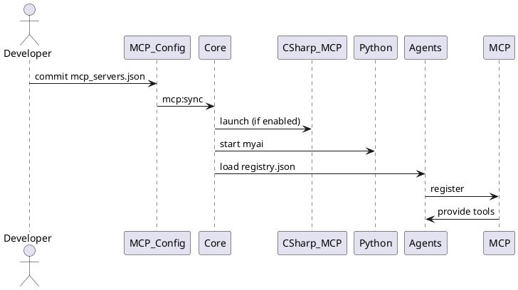

# Agent lifecycle & MCP startup (Implementation-Ready)

Összefoglaló
-----------
Leírja az agent-ek regisztrációját, MCP-szerverek felfedezését és indítási sorrendjét a Brunella rendszeren belül. Célszerűsége: reprodukálható agent-indítás, megbízható MCP-összeköttetés, gyors hibakeresés.

Fő komponensek
--------------
- `csharp-mcp-server` (csharp-mcp-server\launch.ps1) — Windows-specifikus MCP helper
- `workspace-mcp-server` — helyi MCP introspekció
- `brunella-core` (Node) — agent runtime, Express, MCP kliensek
- `myai` (Python) — python-alrendszer (uv/uvicorn)
- `mcp_servers.json` — MCP konfiguráció forrása (auto-sync a .vscode/mcp.json-be)
- `src/agents/registry.json` — agent meta adat

Konfigurációs fájlok
--------------------
- `mcp_servers.json` — tartalmaz MCP szerver szekciókat és indítási parancsokat
- `src/agents/registry.json` — bejegyzések, skill hivatkozások

Indítási sorrend (javasolt)
---------------------------
1. (Opció) csharp MCP warmup: `powershell -File csharp-mcp-server\\launch.ps1 -WarmupOnly`
2. Indítsd a core Node appot dev módban: `npm run dev` vagy stabil: `npm run start:stable`
3. Indítsd a Python alrendszert: `cd myai && uv run uvicorn server:app --port 8000`
4. Ellenőrizd a MCP kapcsolódást: `npm run mcp:validate` és `npm run mcp:sync`
5. Start UI: `npm run dev:ui` (ha szükséges)

Agent regisztráció & discovery
-----------------------------
- A `registry.json` helye: `src/agents/registry.json` (építésnél átmásolódik: `build/agents/registry.json`)
- Új agent: add hozzá a JSON-be, implementáld a MCP handler-t (src/agents/..), írj unit és integration teszteket
- Sync folyamat: `npm run mcp:sync` (ellenőrzi/átírja a .vscode/mcp.json-t)

Szekvencia diagram (PlantUML)
-----------------------------

Tesztelés és hardening
----------------------
- Unit: vitest, mock MCP clients
- Integration: end-to-end kicsi cluster (csharp-mcp-server + Node + myai) a CI pipeline-ban
- Health endpoint: `npm run smoke` és `npm run test:health`

Troubleshooting
---------------
- Ha MCP nem csatlakozik: ellenőrizd `mcp_servers.json` URL-eket és környezeti változókat
- Ha csharp-mcp-server nem indul: futtasd manuális PowerShell parancsot és nézd a konzol kimenetet
- Agent nem regisztrál: ellenőrizd `build/agents/registry.json` jelenlétét (build copy step)

Következő lépés javaslat
-----------------------
- Automatikus diagram generálás: mermaid/PlantUML fájlok létrehozása (docs/diagrams/)
- CI pipeline rész: `test:integration` stage, ami kicsi MCP cluster-t indít és validálja az agent-ek regisztrációját

