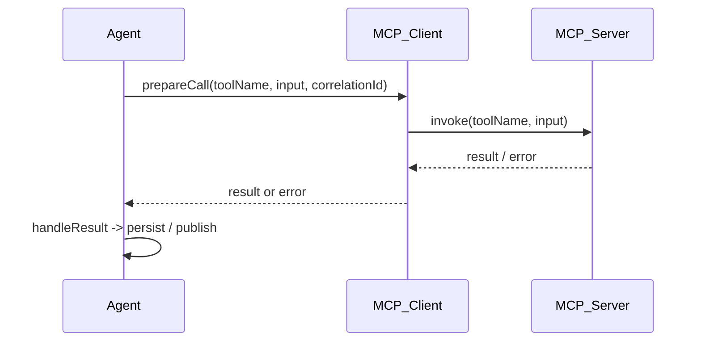

# Agent → MCP tool invocation (Implementation-Ready)

Összefoglaló
-----------
Leírja, hogyan hív egy agent egy MCP tool-t (eszközt) és hogyan kezeljük a választ, hibákat, időkorlátokat és újrapróbálkozást. Fontos a megbízhatóság és idempotencia, valamint a traceability (requestId/correlationId).

Fő komponensek
--------------
- Agent handler (src/agents/...) — bejövő üzenet feldolgozása
- MCP client (src/core/llm_client.ts vagy hasonló)
- MCP server (csharp-mcp-server, workspace-mcp-server)

1) Entry point
--------------
- Trigger: API hívás vagy belső queue üzenet
- Agent kinyeri a paramétereket és előkészíti a tool hívást (input schema egyeztetés)

2) MCP hívás mint mechanika
---------------------------
- Timeout: alkalmazz per-call timeoutot (pl. 30s)
- Retry: exponenciális backoff csak idempotens hívásokra
- Circuit breaker: ha több hiba történik rövid időn belül, nyisd el a kört
- Input validation: szerializálás + schema ellenőrzés (ajánlott JSON Schema)

3) Válasz feldolgozás
---------------------
- Sikeres válasz → map a domain modellre, persistálás, továbbküldés
- Hibás válasz → retriable vagy non-retriable classification, naplózás
- Partial result handling: progress token vagy callback pattern

4) Monitoring és tracing
------------------------
- Minden híváshoz correlationId (UUID) hozzárendelése
- Structured logs: toolName, durationMs, status, errorCode
- Metrics: successRate, latency (p95), retries

5) Tesztek
---------
- Unit: mock MCP client (vi.mock) és assert input formázás
- Integration: lokális MCP server (workspace-mcp-server) futtatása CI-ben és végrehajtani néhány tool hívást

Szekvencia diagram (mermaid)
----------------------------

Implementáció sablon
--------------------
- createToolCall(toolName, payload): returns {callId, startTime}
- await runWithTimeout(callPromise, 30s)
- classifyError(error): {retriable: boolean, code}

Gyakori hibák
------------
- Nincs idempotencia token → duplikált műveletek
- Nincs timeout → agent-blocking
- Nem kezelt partial válaszok → inconsistent state

Következő lépések
-----------------
- Generálni konkrét unit/integration teszteket a `myai` és `Node` kliensekkel
- Instrumentálni a metrics (Prometheus) és a logs (structured JSON)
