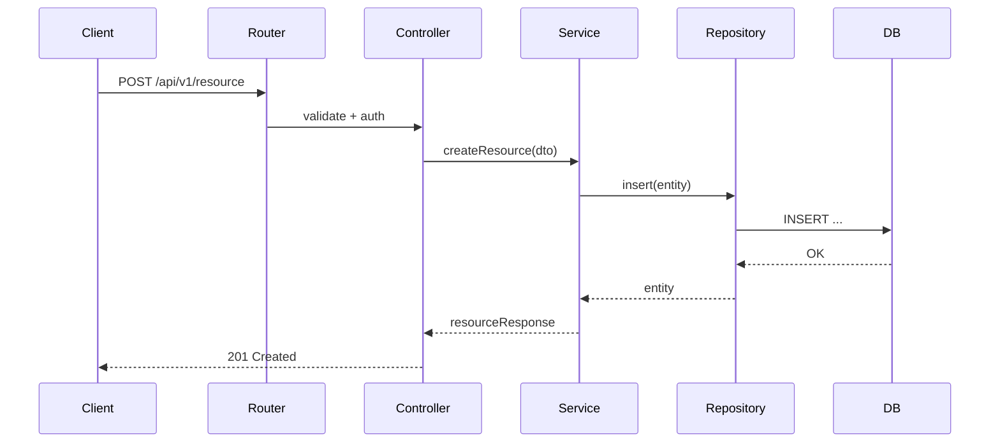

# API → DB end-to-end (Implementation-Ready)

Összefoglaló
-----------
Dokumentálja egy tipikus HTTP API-kérelem teljes útját a Brunella rendszerben: Express vezérlőtől a szolgáltatási rétegen át a repository-ig és adatbázisig. Cél: következetes endpoint-implementáció, tranzakciókezelés és tesztelhetőség.

Előfeltételek
-------------
- Node.js 18+, npm ci
- `npm run build` sikeres
- DB hozzáférés konfigurálva (lokális SQLite vagy távoli SQL)

Workflow áttekintés
-------------------
Trigger: HTTP POST /api/v1/resource → Router → Controller → Service → Repository → DB → vissza a kliens.

1) Entry point (Express)
------------------------
- Fájl: `src/server/routes/*.ts` vagy `src/server/controllers/*Controller.ts`
- Dokumentáld a route definíciót és middleware-eket (auth, validation).
- Request DTO: az összes mező típusával és validációs szabályokkal (zodyn vagy class-validator használata).

2) Service réteg
-----------------
- Állítsd be a szolgáltatás interfészt: `IResourceService`
- Implementáció: tranzakciókezelés, domain logika, külső kliens hívások.
- Dependency injection mintája: konstruktor-injektálás (tsyringe/inversify vagy egyszerű factory pattern).

3) Adatleképezés
----------------
- DTO ↔ Domain mapping: kis helper vagy automapper (pl. automapper-ts) használata
- Validációs szabályok duplikációjának elkerülése: DTO validáció → mapping → domain invariánsok ellenőrzése

4) Data access (Repository)
---------------------------
- Fájl: `src/server/repositories/*Repository.ts`
- Minta: `getById(id)`, `create(entity)`, `update(id, patch)`
- Transakciók: `BEGIN/COMMIT/ROLLBACK` wrapper a repository/DB clientnél
- SQL: ha raw query-k vannak, parametrizált lekérdezés használata

5) Válasz építése és hibakezelés
--------------------------------
- Response DTO: `ResourceResponse` + HTTP státuszkód logika
- Hibák: domain exception → map to API error (status, code, message)
- Globális error middleware: structured logging + correlationId kezelés

6) Aszinkronitás
----------------
- Hosszú műveletek: background job küldése (n8n, message queue vagy internal job runner)
- Transactional outbox pattern javasolt, ha event publication szükséges

7) Tesztelés
------------
- Unit: service metódusok mockolt repository-kkel (vitest + vi.fn())
- Integration: in-memory DB vagy SQLite fájl, futtass integration tesztet `npx vitest run test/integration/...` 
- E2E: Playwright a teljes HTTP útvonal tesztelésére

Szekvencia diagram (mermaid)
----------------------------

Névkonvenciók és sablonok
------------------------
- Controller: `ResourceController` → route: `/api/v1/resources`
- Service: `ResourceService` implementálja `IResourceService`
- Repository: `ResourceRepository`

Implementációs példa (pseudokód)
--------------------------------
- Controller: validate request, call service, return mapped response
- Service: begin tx, call repo, publish event (opcionális), commit tx
- Repo: parametrizált SQL / ORM call

Gyakori hibák
------------
- Hiányzó tranzakció a több-táblás írásoknál
- Nem parametrizált SQL → SQL injection
- Tesztek élő DB-re futtatása izolálás nélkül

Következő lépések
-----------------
- Kiemelni konkrét fájlneveket a repo-ból (`grep` a router és repository mappákra)
- Példákat generálni konkrét DTO/SQL szkriptekkel, ha szeretnéd
